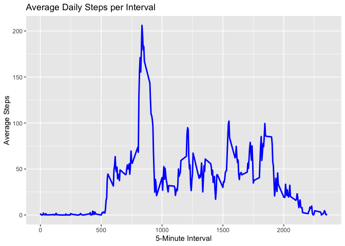

## Introduction

With the advent of activity monitoring devices like Fitbit, Nike
Fuelband, and Jawbone Up, it’s now possible to gather extensive data on
personal movement. These devices are central to the “quantified self”
movement, where individuals regularly track various aspects of their
lives to enhance their health, identify behavioral patterns, or simply
because they enjoy the technology. However, the potential of this data
is often underutilized due to the difficulty in accessing raw data and
the lack of effective statistical tools and software for analyzing it.

This assignment focuses on data collected from a personal activity
monitoring device, which records information at 5-minute intervals
throughout the day. The dataset comprises two months of data from an
anonymous individual, collected during October and November 2012, and
includes the number of steps taken in each 5-minute interval.

The data for this assignment can be downloaded from the course website:

-   Dataset: [Activity monitoring
    data](https://d396qusza40orc.cloudfront.net/repdata%2Fdata%2Factivity.zip)

### The dataset includes the following variables:

-   `steps`: Number of steps taken in a 5-minute interval (with missing
    values coded as `NA`)
-   `date`: The date of the measurement in `YYYY-MM-DD` format
-   `interval`: Identifier for the 5-minute interval during which the
    measurement was taken

The dataset is provided in a comma-separated-value (CSV) file,
containing a total of 17,568 observations.

## Loading and preprocessing the data

Unzip data to obtain a csv file.

## Loading and Preprocessing the Data

``` r
library("data.table")
```

    ## Warning: package 'data.table' was built under R version 4.3.2

``` r
library(ggplot2)
```

    ## Warning: package 'ggplot2' was built under R version 4.3.2

``` r
# Download and unzip dataset
fileUrl <- "https://d396qusza40orc.cloudfront.net/repdata%2Fdata%2Factivity.zip"
download.file(fileUrl, destfile = paste0(getwd(), '/repdata%2Fdata%2Factivity.zip'), method = "curl")
unzip("repdata%2Fdata%2Factivity.zip", exdir = "data")

# Load data into data.table
activityDT <- fread(input = "data/activity.csv")
```

## Reading csv Data into Data.Table.

``` r
activityDT <- data.table::fread(input = "data/activity.csv")
```

## What is mean total number of steps taken per day?

``` r
# Sum of steps per day
Total_Steps <- activityDT[, .(Total_Steps = sum(steps, na.rm = TRUE)), by = date]

# Plot histogram of total steps per day
ggplot(Total_Steps, aes(x = Total_Steps)) +
    geom_histogram(fill = "blue", binwidth = 1000) +
    labs(title = "Total Steps Per Day", x = "Steps", y = "Frequency")
```


``` r
# Calculate mean and median
Total_Steps[, .(Mean_Steps = mean(Total_Steps), Median_Steps = median(Total_Steps))]
```

    ##    Mean_Steps Median_Steps
    ##         <num>        <int>
    ## 1:    9354.23        10395

## What is the average daily activity pattern?

``` r
# Average steps per interval across all days
IntervalDT <- activityDT[, .(Average_Steps = mean(steps, na.rm = TRUE)), by = interval]

# Plot time series of average steps per interval
ggplot(IntervalDT, aes(x = interval, y = Average_Steps)) +
    geom_line(color = "blue", size = 1) +
    labs(title = "Average Daily Steps per Interval", x = "5-Minute Interval", y = "Average Steps")
```

    ## Warning: Using `size` aesthetic for lines was deprecated in ggplot2 3.4.0.
    ## ℹ Please use `linewidth` instead.
    ## This warning is displayed once every 8 hours.
    ## Call `lifecycle::last_lifecycle_warnings()` to see where this warning was
    ## generated.



``` r
# Find the interval with the maximum average steps
IntervalDT[Average_Steps == max(Average_Steps), .(Max_Interval = interval)]
```

    ##    Max_Interval
    ##           <int>
    ## 1:          835

## Imputing missing values

``` r
# Count missing values
activityDT[is.na(steps), .N]
```

    ## [1] 2304

``` r
# Impute missing values with median of steps
activityDT[is.na(steps), steps := median(steps, na.rm = TRUE)]

# Write new dataset with imputed values
fwrite(activityDT, file = "data/tidyData.csv", quote = FALSE)

# Recalculate total steps per day with imputed data
Total_Steps_Imputed <- activityDT[, .(Total_Steps = sum(steps)), by = date]

# Plot histogram of total steps per day after imputation
ggplot(Total_Steps_Imputed, aes(x = Total_Steps)) +
    geom_histogram(fill = "blue", binwidth = 1000) +
    labs(title = "Total Steps Per Day (Imputed Data)", x = "Steps", y = "Frequency")
```

    ## Warning: Removed 8 rows containing non-finite outside the scale range
    ## (`stat_bin()`).


``` r
# Calculate and compare mean and median before and after imputation
Total_Steps_Imputed[, .(Mean_Steps = mean(Total_Steps), Median_Steps = median(Total_Steps))]
```

    ##    Mean_Steps Median_Steps
    ##         <num>        <int>
    ## 1:         NA           NA

## Are there differences in activity patterns between weekdays and weekends?

``` r
# Convert date to POSIXct and create 'Day of Week' column
activityDT[, date := as.POSIXct(date, format = "%Y-%m-%d")]
activityDT[, Day_of_Week := weekdays(date)]

# Create factor variable for weekday/weekend
activityDT[, Weekday_Weekend := ifelse(Day_of_Week %in% c("Saturday", "Sunday"), "weekend", "weekday")]
activityDT[, Weekday_Weekend := as.factor(Weekday_Weekend)]

# Calculate average steps per interval by weekday/weekend
Interval_Weekday_Weekend <- activityDT[, .(Average_Steps = mean(steps, na.rm = TRUE)), by = .(interval, Weekday_Weekend)]

# Plot time series for weekday vs weekend
ggplot(Interval_Weekday_Weekend, aes(x = interval, y = Average_Steps, color = Weekday_Weekend)) +
    geom_line() +
    labs(title = "Average Steps Per Interval by Weekday/Weekend", x = "5-Minute Interval", y = "Average Steps") +
    facet_wrap(~ Weekday_Weekend, ncol = 1)
```


